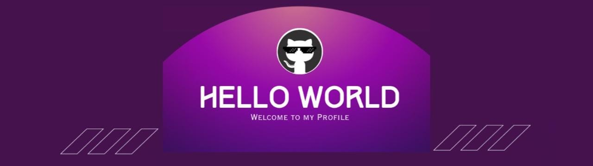

<!--Banner-->

<!--Night Owl image-->

  

<!--Header Name-->
#  ɪ'ᴍ Syed Saad Akhtar! 
*Computer Science Student ( Programmer)*
  

<!--Start Intro-->               

I am a programmer and Machine Learning Enthusiast with a huge love for Python, Chisel, Java, Django, DBMS and Data Visualization. 

- 🌱 I’m currently learning many things, I believe that everyday is a learning opportunity.
- 💁‍♂️ Research Intern at @MERL
- ❤ Contributing to Open Source.
<!--End Intro-->

<!--Profile Count Badge-->

  

<!--Languages and Tools Section-->       
<h2 align="center">Tᴇᴄʜ sᴛᴀᴄᴋ & Lᴀᴛᴇsᴛ ʙʟᴏɢs</h2> 
<picture>
  <source media="(prefers-color-scheme: dark)" srcset="./Skills_Animation_Dark.gif">
  <source media="(prefers-color-scheme: light)" srcset="./Skills_Animation_White.gif">
  
</picture>
 

<h3 align="left">Current Learning</h3>
<ul align="left">
  <li>Deepening my knowledge in Machine Learning and AI.</li>
  <li>Exploring Mobile App developmet with Flutter.</li>
  <li>Improving my skills in Data Analytics with AWS.</li>
</ul>
  
<h3 align="left">Latest Projects</h3>
<ul align="left">
  
  <li><a href="https://github.com/SSaadAKHTAR/oxygen">🧙‍♂️ Oxygen: A RISC-V assembly simulator</a></li>
  <li><a href="https://github.com/SSaadAKHTAR/RV32I-Five-Stage-Pipeline">🚀 RV32I: A 5 stage pipeline</a></li>

 
  
</ul>
 
 
 
 

<!--Dynamic Quote card updates everyday at 12 PM--> 
 
<h2 align="center">🌟 Tʜᴏᴜɢʜᴛ ᴏғ ᴛʜᴇ Dᴀʏ 🌟</h2>

<!--STARTS_HERE_QUOTE_CARD-->

    

<!--ENDS_HERE_QUOTE_CARD-->

<!--Contact Section--> 

<h2 align="center">🤝 Cᴏɴɴᴇᴄᴛ Wɪᴛʜ Mᴇ 🤝 </h2>

  

 

<!--Buy me a coffee-->

<!--Footer--> 

  

